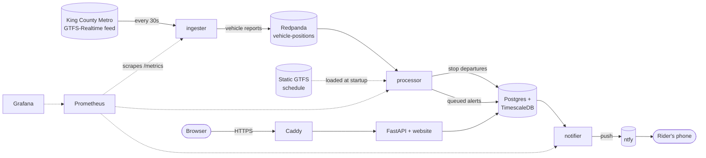

# Transit Reliability

[](https://github.com/SavitP/Transit-Reliablility/actions/workflows/ci.yml)

**How late are King County Metro buses, really?**
Live at **[transitreliability.com](https://transitreliability.com)**

This project tracks every King County Metro bus in real time. It compares each bus's position
with the published schedule, stores every departure, and shows which routes and stops are
reliably unreliable. Riders can also sign up for a phone notification when their commute bus is
running late, before it reaches their stop.

It's a learning project, built in ten phases from a single script to a monitored, deployed
system. [`LEARNING.md`](LEARNING.md) explains each phase in plain language.

---

## Features

- **Route and stop pages:** on-time percentage overall, by hour of day, by day of week, and as a
  day × hour grid, plus typical and "bad day" (90th percentile) delays.
- **Least reliable routes** ranking for the last 24 hours, 7 days, or 30 days.
- **Commute alerts:** pick a route, your stop, days, and a time window. When a bus due in that
  window is running late (confirmed twice), you get a push notification through
  [ntfy](https://ntfy.sh) saying when it's now expected at your stop. No account needed.
- **Built to run unattended:** crash recovery with no data loss, health metrics and alert rules,
  automatic HTTPS, daily backups, and CI that tests and builds every push.

"On time" uses Metro's definition: no more than 1 minute early and no more than 5 minutes late.

---

## How it works



1. **Ingester** downloads Metro's live vehicle positions (protobuf) every 30 seconds and publishes
   one message per bus to Redpanda, keyed by trip so each trip's reports stay in order.
2. **Processor** matches each report to its scheduled trip and stop. When two consecutive reports
   show a bus has moved past a stop, it estimates the departure time as the halfway point between
   them and compares it to the schedule. It then stores the delay and checks alert subscriptions.
   Delay estimates agree with Metro's own predictions within 1 minute for about 84% of trips.
3. **Notifier** sends queued alerts to ntfy, with retries and expiry (the *outbox* pattern), so a
   slow notification service never holds up data collection.
4. **API** (FastAPI) serves JSON and the website. It reads through a database user that can't
   modify collected data.
5. **Caddy** is the only public entry point: HTTPS certificates from Let's Encrypt, renewed
   automatically.

Restarts are safe. The processor rewinds a few minutes in the stream to rebuild its memory of each
bus, and the database's primary key silently drops departures it has already saved.

---

## Tech stack

| Area | Tools |
|---|---|
| Language | Python 3.11 |
| Transit data | [GTFS](https://gtfs.org/) static schedule and GTFS-Realtime (protobuf) via `gtfs-realtime-bindings` |
| Message stream | [Redpanda](https://redpanda.com/) (Kafka-compatible), `confluent-kafka` client |
| Database | PostgreSQL 17 + [TimescaleDB](https://www.timescale.com/): hypertable, compression, continuous aggregate |
| API and website | FastAPI + uvicorn, plain HTML/CSS/JavaScript (no framework) |
| Notifications | [ntfy](https://ntfy.sh) |
| Monitoring | Prometheus (metrics + alert rules), Grafana (pre-built dashboard) |
| Packaging | Docker (multi-stage, amd64 + arm64), Docker Compose |
| CI/CD | GitHub Actions → GitHub Container Registry |
| Hosting | Hetzner Cloud (Ubuntu 24.04), Caddy for HTTPS |

---

## Run it locally

**Prerequisites:** Docker Desktop and Git. Python 3.11 is only needed to run the tests.

```bash
git clone https://github.com/SavitP/Transit-Reliablility.git
cd Transit-Reliablility
cp .env.example .env           # fine as-is for local use; change the passwords if you like
docker compose up -d --build
```

The first start downloads about 5 GB of images and Metro's 10 MB schedule. Within a minute or two:

| What | Where |
|---|---|
| Website | http://localhost:8000 |
| API docs (interactive) | http://localhost:8000/docs |
| Grafana (user `admin`, password `GRAFANA_ADMIN_PASSWORD` from `.env`) | http://localhost:3000 |
| Prometheus | http://localhost:9090 |
| Postgres | `localhost:5433`. With `psql` installed: `source .env && psql "$DATABASE_URL"`. Without it: `docker compose exec db psql -U transit -d transit` |

Data builds up as buses move, so charts start empty. Useful commands:

```bash
docker compose ps                              # everything should be Up
docker compose logs -f processor               # watch departures being recorded
source .env && psql "$DATABASE_URL" -f queries.sql   # example SQL questions
docker compose down                            # stop (data is kept in Docker volumes)
```

All ports are bound to `127.0.0.1`, so nothing is reachable from other machines on your network.

---

## Tests

70 tests: unit tests for the schedule time math, feed decoding, matching, delay, and alert logic,
using recorded real feed snapshots in `tests/fixtures/`, so no internet is needed. Integration
tests run the schema, API, and notifier against a real TimescaleDB.

```bash
python3.11 -m venv .venv && source .venv/bin/activate
pip install -r requirements-dev.txt
docker compose up -d db
docker compose exec db createdb -U transit transit_test   # once
pytest
```

The database tests use `TEST_DATABASE_URL` from `.env`. They **refuse to run** against any database
whose name doesn't end in `_test`, because they delete data. Without it, those tests are skipped.

On every push, [CI](.github/workflows/ci.yml) runs the tests against a fresh TimescaleDB, validates
the Compose file, Caddyfile, and Prometheus rules, and builds the image. On `main` it publishes the
image to `ghcr.io/savitp/transit-reliablility`.

---

## Configuration

Everything is set in `.env`, which git ignores. [`.env.example`](.env.example) lists every setting.

| Variable | Used for |
|---|---|
| `POSTGRES_PASSWORD` | Database password |
| `DATABASE_URL` | Connection string for tools run on the host (`psql`, tests) |
| `TEST_DATABASE_URL` | Separate database for integration tests (must end in `_test`) |
| `GRAFANA_ADMIN_PASSWORD` | Grafana `admin` login |
| `DOMAIN` | *Production:* the site's domain (Caddy gets certificates for it and `grafana.` + it) |
| `API_DB_PASSWORD` | *Production:* password for the API's restricted database user |
| `NTFY_URL` | *Optional:* ntfy server for alerts (default `https://ntfy.sh`) |
| `SITE_URL` | *Optional:* link opened from a notification (production uses `https://$DOMAIN`) |

---

## Deployment

Production runs the same Compose file plus [`docker-compose.prod.yml`](docker-compose.prod.yml),
which adds Caddy, uses CI's published image instead of building, and keeps every service except
Caddy off the public internet. A 4 GB server is the minimum; the whole stack uses about 2 GB of memory.

[`DEPLOY.md`](DEPLOY.md) walks through it step by step: server setup (SSH keys only, firewall,
automatic security updates), DNS, secrets, first start, daily backups (with a tested restore), and
an outside uptime check against `/api/health`.

Deploying a new version after CI passes:

```bash
ssh transit@YOUR_SERVER_IP
cd Transit-Reliablility && ./deploy/update.sh
```

---

## Monitoring

Grafana's **Transit pipeline health** dashboard shows feed age, processor lag, messages waiting,
events per second, share of buses matched to the schedule, departures per minute, database write
time, and alert delivery. Prometheus alert rules fire when:

| Alert | Means |
|---|---|
| `ServiceDown` | Ingester, processor, or notifier isn't responding |
| `FeedStale` | Newest feed is over 5 minutes old (Metro's feed or the ingester is stuck) |
| `ProcessorFallingBehind` | Processor is over 5 minutes behind |
| `LowMatchRate` | Under 80% of buses match the schedule (usually a new Metro schedule) |
| `NotificationsFailing` / `NtfyRateLimited` | Alerts aren't reaching riders |

`GET /api/health` returns 503 if the database is unreachable or no departure was saved in the last
hour. It's meant for an external uptime checker.

---

## API

Interactive docs are at [`/docs`](https://transitreliability.com/docs). Main endpoints:

| Endpoint | Returns |
|---|---|
| `GET /api/search?q=` | Routes and stops matching a name or number |
| `GET /api/routes/{route_id}?days=7` | On-time stats for a route: overall, by hour, by day, day × hour |
| `GET /api/stops/{stop_id}?days=7` | Same for a stop, plus each route at that stop |
| `GET /api/worst-routes?days=7` | Routes ranked from least to most on time |
| `GET /api/routes/{id}/stops`, `GET /api/stops/{id}/routes` | Which stops a route serves, and vice versa |
| `POST /api/subscriptions` | Create a commute alert |
| `GET` / `DELETE /api/subscriptions/{id}` | View or delete an alert |
| `POST /api/subscriptions/{id}/test` | Send a test notification |
| `GET /api/health` | Pipeline health for uptime monitoring |

---

## Project layout

```
fetch_vehicles.py   download and decode the live feed
schedule.py         load the static GTFS schedule; service-day time math
delays.py           match reports to the schedule; detect stop departures
alerts.py           decide when a rider should be alerted
ingester.py         service: feed → Redpanda
processor.py        service: Redpanda → delays + alerts → Postgres
notifier.py         service: queued alerts → ntfy
api.py              service: JSON API + website
db.py, schema.sql   database access and table design
stream.py, metrics.py   shared Redpanda settings and Prometheus metrics
static/             the website (HTML/CSS/JS)
tests/              pytest suite and recorded feed fixtures
monitoring/         Prometheus config and alert rules; Grafana data source and dashboard
deploy/             Caddyfile and server setup, update, and backup scripts
queries.sql         example SQL for exploring the data
LEARNING.md         plain-language notes for each build phase
DEPLOY.md           step-by-step deployment guide
```

---

## Limitations

- **Delay is measured when a bus leaves a stop**, estimated between two ~30-second reports:
  accurate to about ±15 seconds. Every stop is measured, not just Metro's official timepoints, so
  figures won't exactly match Metro's published statistics.
- **Recent data is left out** (the last 30 minutes) because late buses for those times may not
  have left yet. The "worst routes" summary also covers completed hours only.
- **Alert times are projections:** "expected around 8:18" assumes the bus stays as late as it is
  now. There's at most one alert per trip and one per subscription per 30 minutes.
- **The public ntfy.sh server** allows this site about 250 notifications a day in total. Point
  `NTFY_URL` at your own ntfy server for more.
- **Schedule updates:** Metro's schedule is re-downloaded when the processor starts and its copy is
  over a day old. After a Metro service change, restart the processor (`LowMatchRate` will flag it).

---

## Data

Vehicle positions and schedules come from King County Metro's public
[GTFS-Realtime feed](https://s3.amazonaws.com/kcm-alerts-realtime-prod/vehiclepositions.pb) and
[GTFS schedule](https://metro.kingcounty.gov/GTFS/google_transit.zip), subject to King County
Metro's terms of use. This project isn't affiliated with or endorsed by King County Metro.
